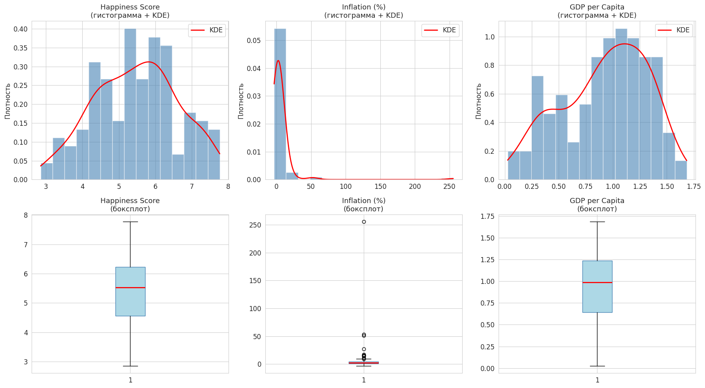
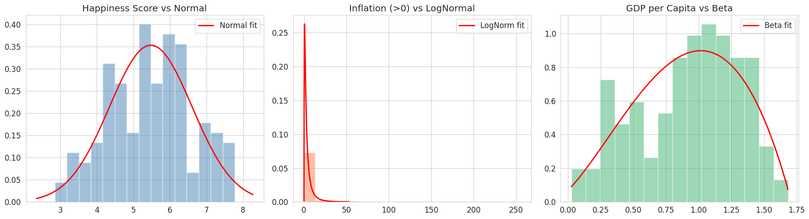
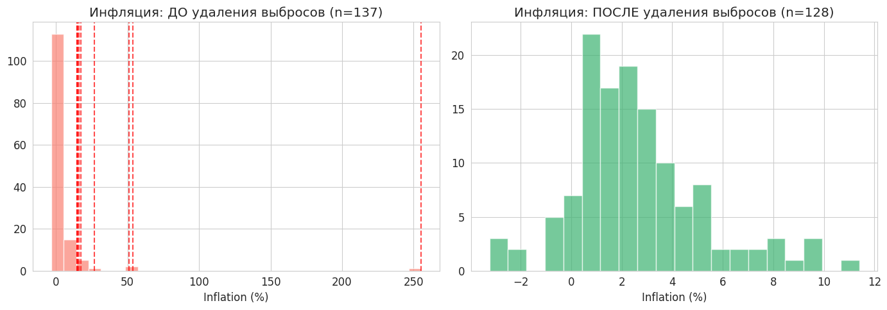
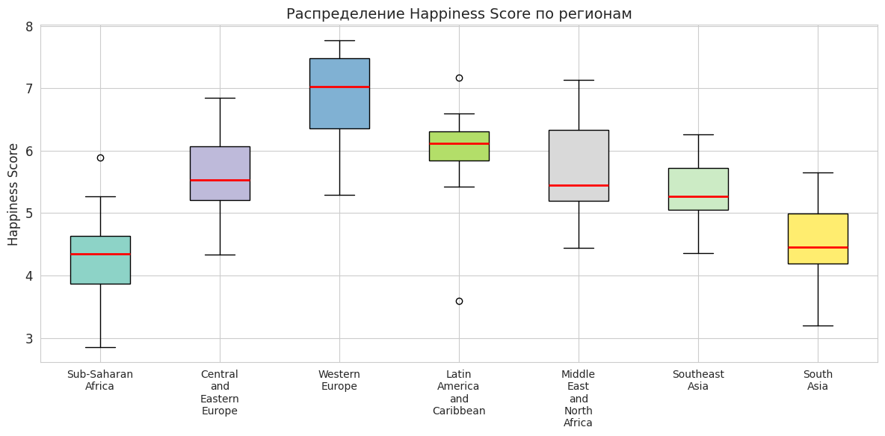
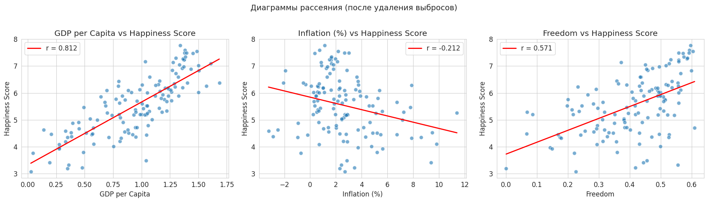
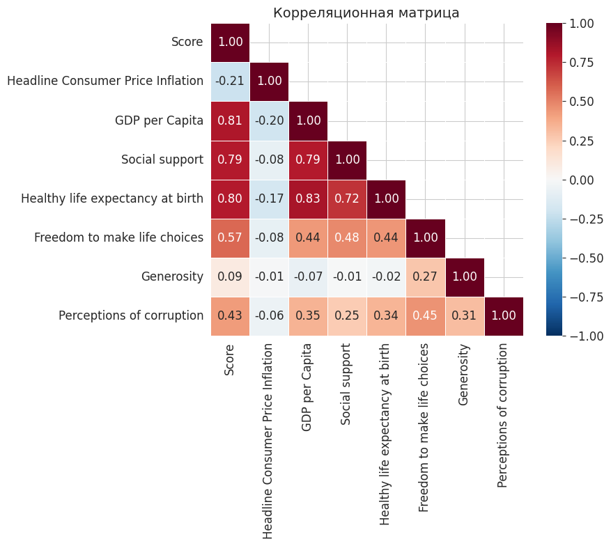
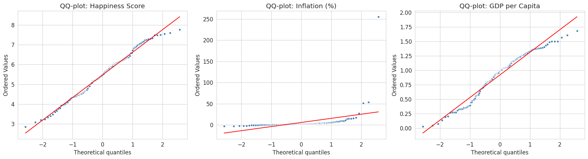

# Inflation, GDP & Happiness: A Statistical Analysis

Статистическое исследование взаимосвязи инфляции, ВВП на душу населения и субъективного ощущения счастья по данным 137 стран за 2019 год. Ключевой результат: ВВП на душу населения — сильнейший предиктор счастья (r ≈ 0.78), тогда как инфляция оказывает слабое негативное влияние (r ≈ −0.2).

---

## Контекст задачи

Правительства и международные организации всё чаще используют индексы субъективного благополучия для оценки качества жизни. Но какие экономические факторы действительно влияют на ощущение счастья?

Этот проект отвечает на вопрос: **влияет ли уровень инфляции и экономическое благосостояние на субъективное счастье в стране?** Для ответа применён полный арсенал методов математической статистики — от оценки параметров до проверки гипотез о независимости.

---

## Данные

**Источник:** объединённый датасет World Happiness Index + IMF Inflation Data.

| Параметр | Значение |
|---|---|
| Полный датасет | 1 232 наблюдения, 148 стран, 2015–2023 |
| Рабочая выборка | 137 стран (кросс-секция 2019 года) |
| Признаков | 16 (инфляция, ВВП, соц. поддержка, ожидаемая продолжительность жизни, свобода выбора и др.) |
| Целевая переменная | Happiness Score (World Happiness Report) |

---

## Пайплайн анализа

**1. Загрузка и первичная обработка** — фильтрация по году, удаление пропусков, формирование трёх основных выборок (Happiness, Inflation, GDP).

**2. Описательные статистики и визуализация** — гистограммы, боксплоты, QQ-графики. Выявлена нормальность Happiness Score, сильная правая асимметрия инфляции, левая скошенность GDP.

**3. Оценка параметров** — метод моментов (ММ) и метод максимального правдоподобия (МНП) для нормального распределения Happiness Score. Построены доверительные интервалы для μ и σ².

**4. Проверка согласия (критерий Пирсона χ²)** — Happiness ~ Normal (подтверждено), Inflation ~ LogNormal, GDP ~ Beta.

**5. Отбраковка выбросов (критерий Граббса)** — итеративное удаление аномалий, в первую очередь стран с гиперинфляцией (Венесуэла, Зимбабве и др.).

**6. Проверка однородности (χ²)** — распределение счастья значимо различается между регионами.

**7. Проверка независимости (χ² + корреляция)** — Happiness × GDP зависимы; корреляционный анализ с t-критерием для нормальных выборок.

---

## Результаты

### Ключевые метрики корреляции

| Пара признаков | r | Значимость |
|---|---|---|
| Happiness ↔ GDP per Capita | ≈ 0.78 | Значимая (p < 0.05) |
| Happiness ↔ Inflation | ≈ −0.20 | Слабая |
| Happiness ↔ Freedom | Умеренная положительная | Значимая |

### Основные выводы

- Happiness Score хорошо описывается нормальным распределением (N(5.48, 1.13²)) — подтверждено критерием Пирсона, QQ-графиком и тестом Шапиро–Уилка.
- Инфляция имеет сильную правую асимметрию: медиана ≈ 2.3%, среднее ≈ 5.8% — за счёт стран с гиперинфляцией.
- Уровень счастья **значимо различается** между регионами мира (χ²-критерий однородности, H₀ отвергнута).
- ВВП на душу населения — наиболее сильный предиктор счастья. Инфляция влияет слабо и скорее опосредованно — через общий уровень экономического развития.

### Контринтуитивная находка

Инфляция сама по себе слабо связана со счастьем. Это означает, что умеренная инфляция в развитой стране практически не снижает субъективное благополучие, тогда как для бедных стран любая экономическая нестабильность критична.

---

## Визуализации

### Распределения переменных: гистограммы и боксплоты

<p align="center">
  
</p>

### Теоретические vs эмпирические распределения (критерий Пирсона)

<p align="center">
  
</p>

### Инфляция: до и после удаления выбросов (критерий Граббса)

<p align="center">
  
</p>

### Счастье по регионам мира

<p align="center">
  
</p>

### Диаграммы рассеяния с линиями регрессии

<p align="center">
  
</p>

### Корреляционная матрица &nbsp;&nbsp;|&nbsp;&nbsp; QQ-графики

<p align="center">
  &nbsp;&nbsp;
  
</p>

---

## Структура репозитория

```
├── README.md
├── requirements.txt
├── .gitignore
├── LICENSE
├── notebooks/
│   └── statistical_analysis.ipynb   # Основной ноутбук с полным анализом
├── data/
│   └── WHI_Inflation.csv            # Данные: WHI + IMF Inflation (148 стран, 2015–2023)
└── plots/
    ├── 01_distributions_histograms_boxplots.png
    ├── 02_theoretical_vs_empirical.png
    ├── 03_inflation_outliers_before_after.png
    ├── 04_happiness_by_region_boxplot.png
    ├── 05_scatter_regression.png
    ├── 06_correlation_heatmap.png
    └── 07_qq_plots.png
```

---

## Запуск

```bash
git clone https://github.com/<your-username>/inflation-gdp-happiness.git
cd inflation-gdp-happiness
pip install -r requirements.txt
jupyter notebook notebooks/statistical_analysis.ipynb
```

---

## Стек технологий

Python 3 · NumPy · Pandas · SciPy · Matplotlib · Seaborn · Jupyter Notebook

---

## Навыки, применённые в проекте

| Область | Что именно продемонстрировано |
|---|---|
| Статистический анализ | Описательные статистики, оценка параметров (ММ, МНП), доверительные интервалы |
| Проверка гипотез | Критерий Пирсона (согласие, однородность, независимость), критерий Граббса, t-критерий для корреляции |
| Работа с распределениями | Подбор распределений (Normal, LogNormal, Beta), QQ-графики, goodness-of-fit |
| Обработка данных | Очистка выбросов, фильтрация кросс-секций, работа с пропусками |
| Визуализация | Гистограммы, боксплоты, heatmap корреляций, scatter + регрессия, QQ-plots |
| Самостоятельная реализация | Все статистические критерии реализованы вручную (без готовых тестов из statsmodels) |
| Интерпретация результатов | Бизнес-выводы из статистических тестов, рекомендации для policy-making |

---

## Лицензия

MIT — см. [LICENSE](LICENSE).
